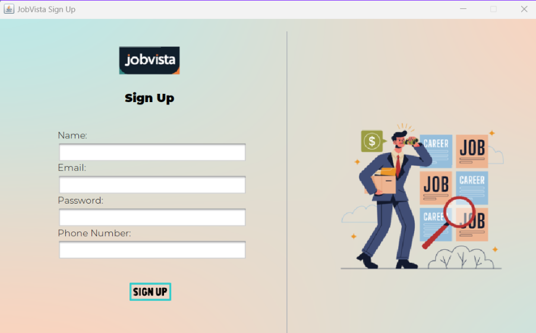
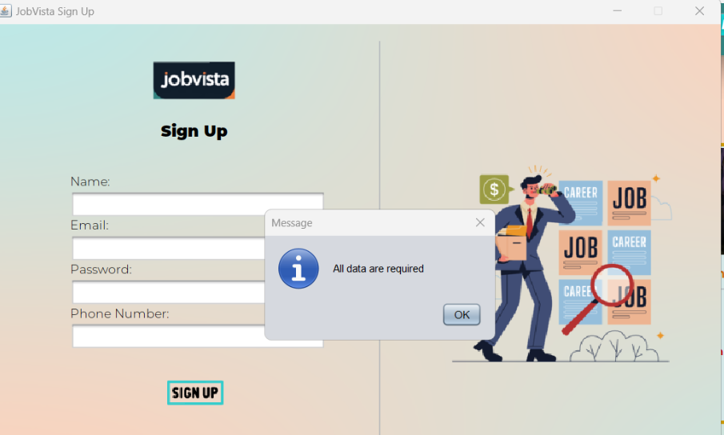
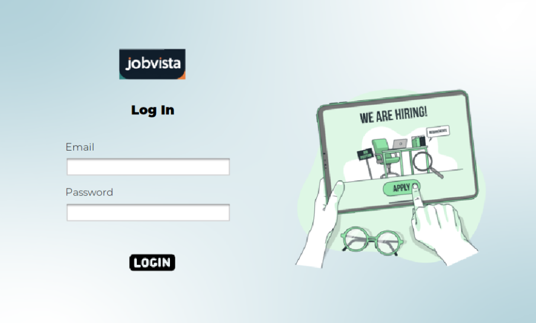
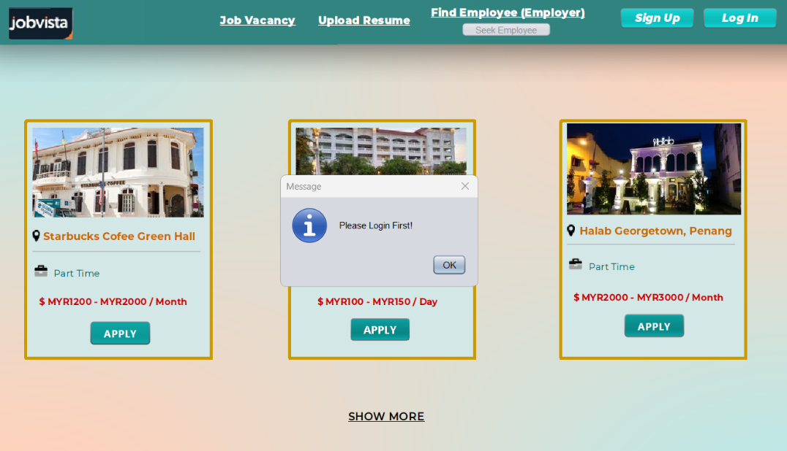
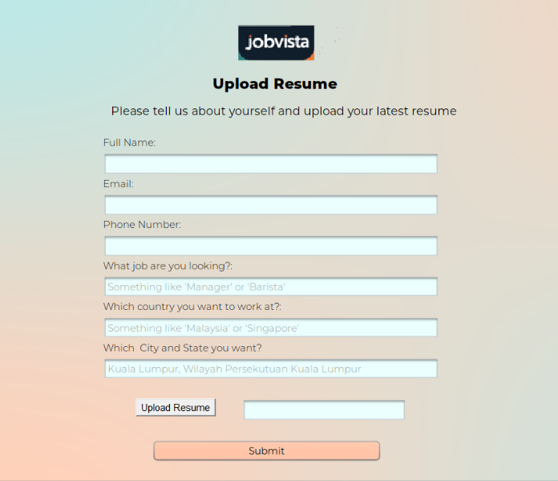
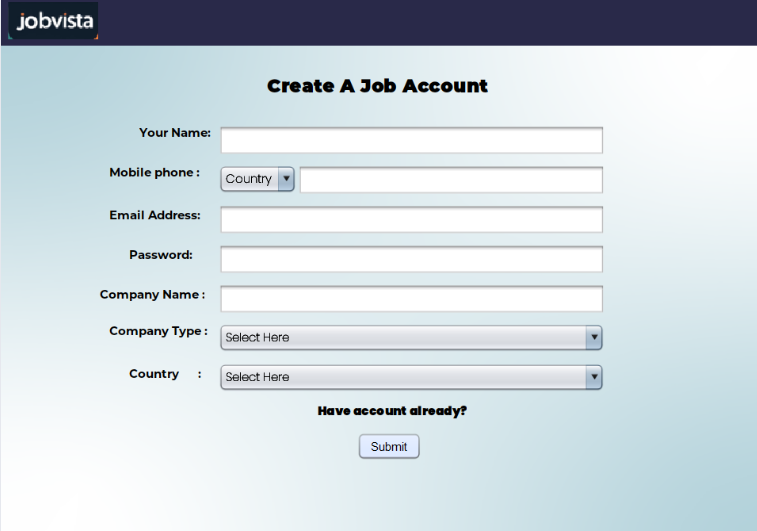
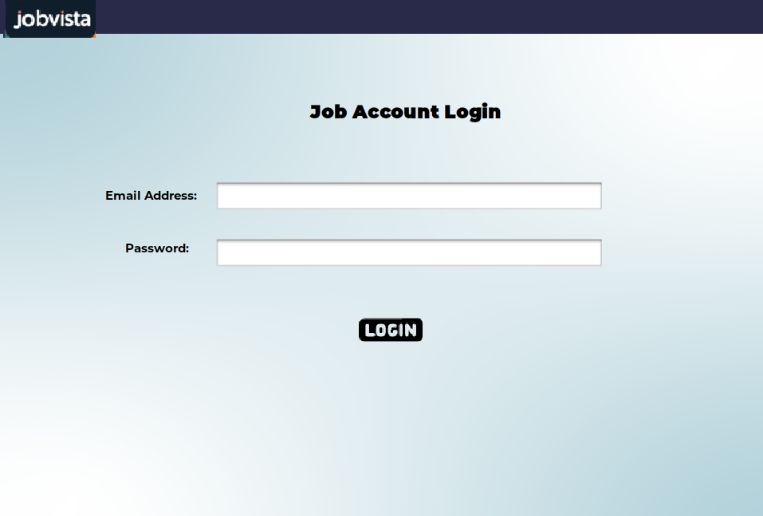
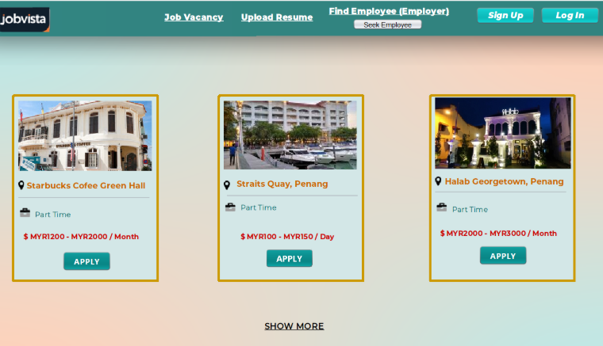
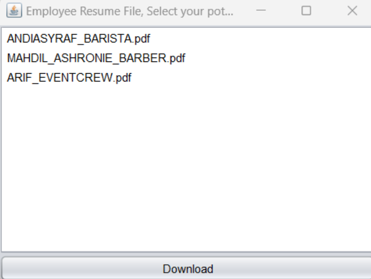
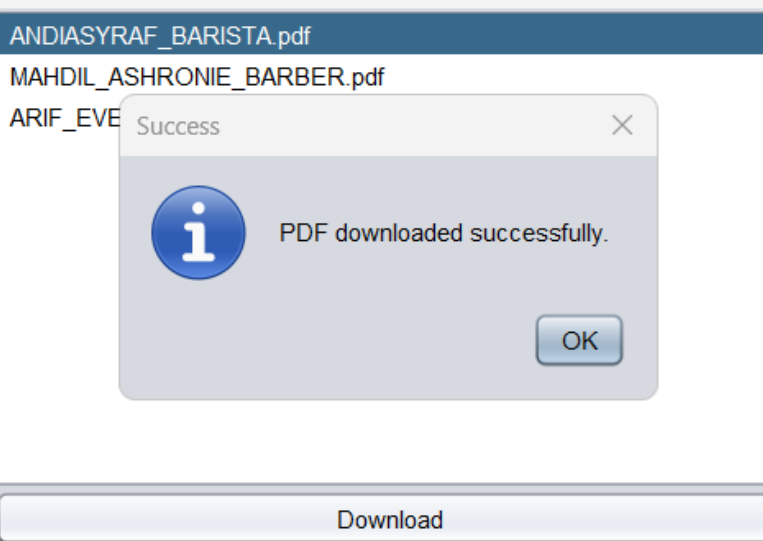

# JobVista

JobVista is really simple web-based application that connects job seekers and employers. Job seekers can upload resumes and explore job opportunities, while employers can browse through resumes to find suitable candidates. Built with **NetBeans** using **Java** and **JavaScript**, JobVista simplifies the recruitment process. 

## Features
- **Resume Upload**: Job seekers can upload their resumes for job applications.
- **Job Search**: Browse and apply to available job vacancies.
- **Company Access**: Employers can browse resumes to find suitable candidates.
- **Streamlined Recruitment**: Simplifies and speeds up the hiring process. 

## Limitations 
- Limited Job Posting Access for Job Seekers: Currently, job seekers cannot post job listings or hiring content directly on the platform. Only administrators or backend users have the authority to add job postings, which limits the ability of job seekers to actively contribute to the job vacancy list. This creates a dependency on administrators to manage available job opportunities.

## Tech Stack
- **Java & JavaScript** (Back-end) 
- **NetBeans IDE** (Front-end & Development Environment)

### Screenshots

## Job Seeker

.png)
.png)

.png)
.png)

## Employer

